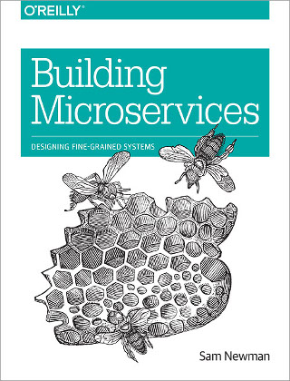
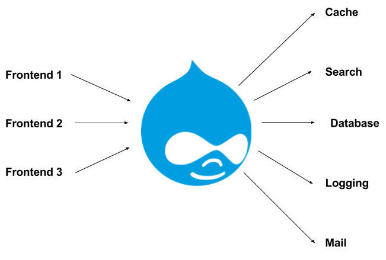
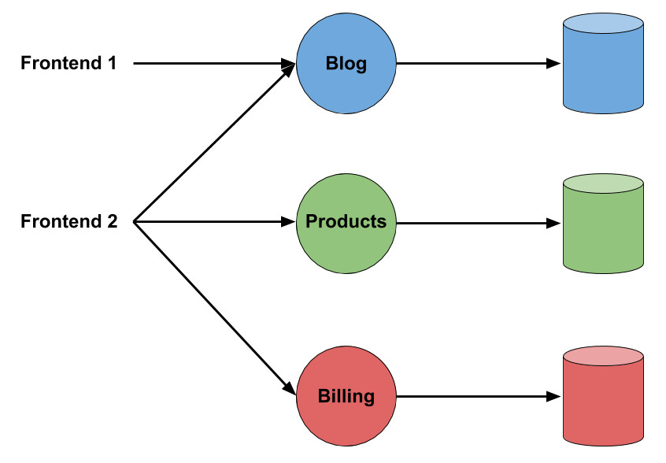
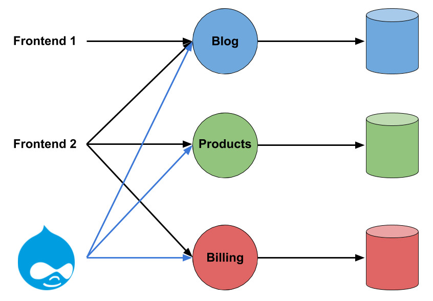
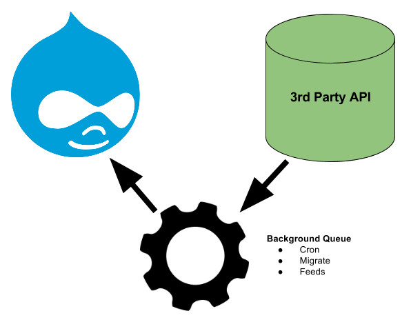
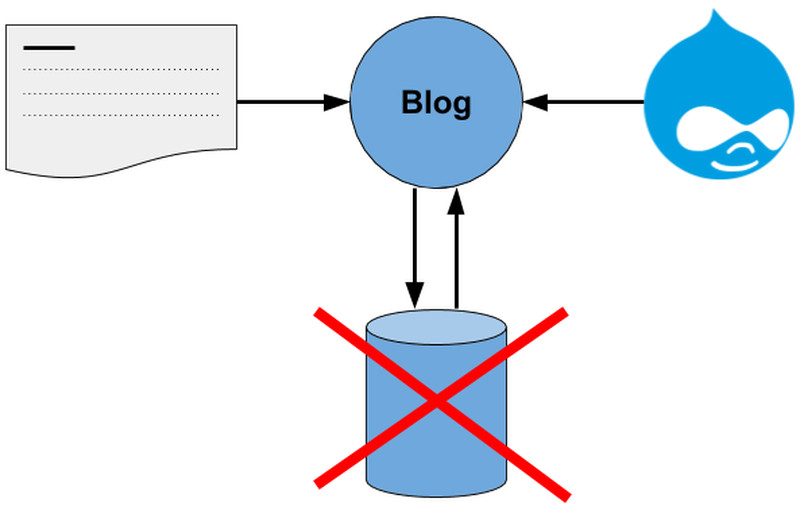

# Drupal 

## + Microservices

Nick Schuch

<nick@previousnext.com.au>

[@iamschuch](https://twitter.com/iamschuch)

---

## TL;DR

- What are Microservices?
- Where does Drupal 8 fit?
- Demo
- Questions

---

## Experiment out of spite

* Plenty of frontend focused examples
* Not enough backend examples

---

## What are Microservices?

_The term "Microservice Architecture" has sprung up over the last few years to describe a particular way of designing software applications as suites of independently deployable services. While there is no precise definition of this architectural style, there are certain common characteristics around organization around business capability, automated deployment, intelligence in the endpoints, and decentralized control of languages and data._

**Martin Fowler**

---

## What are Microservices?

- **Business Capability** - Designed for the domain of the business
- **Intelligence in the Endpoints** - Well designed API
- **Decentralized Control of Languages and data** - I can write Golang for this presentation!

---

## Building Microservices



http://shop.oreilly.com/product/0636920033158.do

---

## What are Microservices? (Nick edition)

* Interchangable
* Simple
* Do one thing and do it well

---

## The Unix Philosophy

- Write programs that do one thing and do it well.
- Write programs to work together.
- Write programs to handle text streams, because that is a universal interface.

https://en.wikipedia.org/wiki/Unix_philosophy

---

## The Unix Philosophy (Cont.)

In 1986 an interviewer asked Donald Knuth to write a program that takes a text and a number N in input, and lists the N most used words sorted by their frequencies. Knuth produced a 10-pages Pascal program, to which Douglas McIlroy replied with the following 6-lines shell script

```bash
tr -cs A-Za-z '\n' |
tr A-Z a-z |
sort |
uniq -c |
sort -rn |
sed ${1}q
```

---

### Drupal is a Monolith



---

### Drupal is a Monolith

 

---

## Where do we fit?



---

## Here!



---

## Why?

- Content editor experiece
- Extend backends for best practices
  - Logging
  - Authentication
  - Mail
  - Search

---

## Drupal 7



---

## Drupal 8

* [Content Entity](https://www.drupal.org/docs/8/api/entity-api/create-a-custom-content-entity)
* Overridden storage

---

## Demo



---

## Questions?

---

## Thankyou

Nick Schuch

<nick@previousnext.com.au>

[@iamschuch](https://twitter.com/iamschuch)
